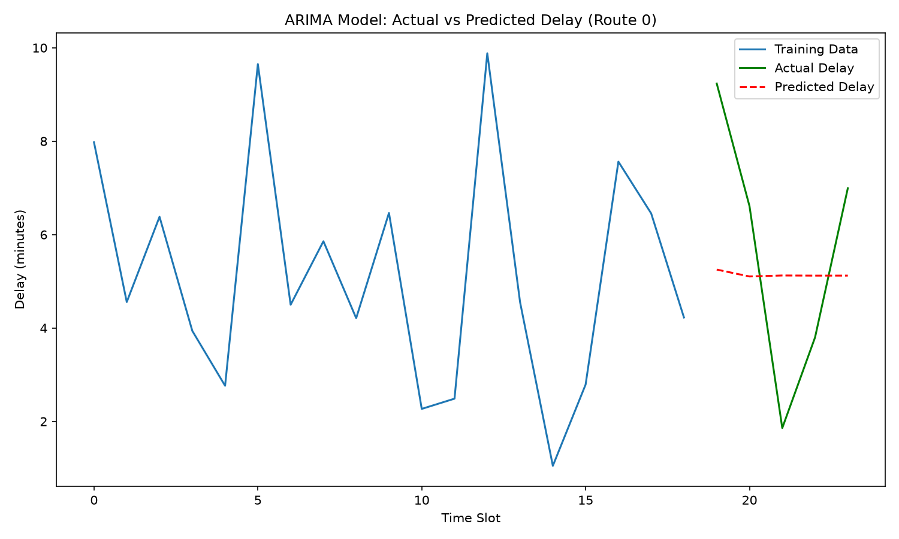

# 🚌 Real-Time Public Transport Delay Prediction

## 📖 Overview
This project is a machine learning application designed to predict bus delays. By analyzing historical route data, the system estimates how many minutes a bus will be delayed based on the route, time of day, and average speed.

## 📊 Models & Results
I trained and compared three different models to find the most accurate prediction:
- **Random Forest:** 2.46 minutes Mean Absolute Error (MAE)
- **ARIMA:** 2.39 minutes MAE (**Best Performing Model**)
- **LSTM:** 2.88 minutes MAE

*(The ARIMA model performed the best because it is specifically designed to find time-based patterns in data.)*

## 📈 Visualizations
Below are the results from the project:


*(The bar chart above compares the error rates of all three models.)*


*(The line graph above shows the actual vs. predicted delays over time.)*

## 🛠️ Technologies Used
- **Programming Language:** Python
- **Data Handling:** Pandas, NumPy
- **Machine Learning:** Scikit-learn
- **Time Series Forecasting:** Statsmodels
- **Deep Learning:** TensorFlow/Keras
- **Web Application:** Streamlit
- **Data Visualization:** Matplotlib, Seaborn

## 🚀 How to Run This Project

1. **Clone the repository:**
   ```bash
   git clone https://github.com/YourUsername/Real-Time-Public-Transport-Delay-Prediction.git
